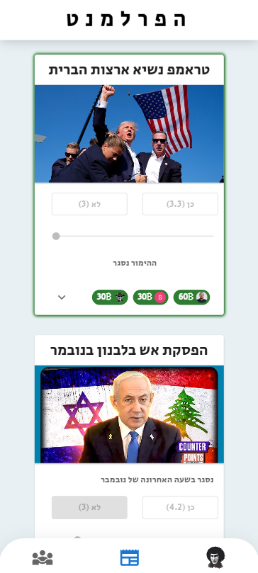

# The Parliament

**Live Website:** [https://ha-parliament.web.app/](https://ha-parliament.web.app/)

   

## Description

The Parliament is a fun, real-time betting application built for friends and casual users. It allows users to place bets on various worldwide events using a system of "fake money." The application features:

* **Real-time Betting:** Live updates on betting odds and results.
* **Worldwide Events:** Bets on a diverse range of global events.
* **Leaderboard:** A competitive leaderboard showcasing user statistics and rankings.
* **Fake Money System:** A fun, risk-free betting experience without real monetary involvement.
* **Firebase Backend:** Robust and scalable backend for real-time data and user management.
* **MUI Frontend:** A clean and responsive user interface built with Material UI.

This project is intended for entertainment purposes only and is not associated with any real-money gambling.

## Technologies Used

* **React:** Frontend framework.
* **Firebase:** Backend services (Realtime Database, Authentication, Hosting).
* **Material UI (MUI):** UI component library.
* **JavaScript:** Programming language.

## Getting Started

To run this project locally, follow these steps:

1.  **Clone the repository:**

    ```bash
    git clone <your-repository-url>
    cd the-parliament
    ```

2.  **Install dependencies:**

    ```bash
    npm install
    ```

3.  **Set up Firebase:**

    * Create a Firebase project at [console.firebase.google.com](https://console.firebase.google.com).
    * Enable Realtime Database and Authentication.
    * Create a `.env.local` file in the root of your project and add your Firebase configuration:

        ```
        REACT_APP_FIREBASE_API_KEY=YOUR_API_KEY
        REACT_APP_FIREBASE_AUTH_DOMAIN=YOUR_AUTH_DOMAIN
        REACT_APP_FIREBASE_DATABASE_URL=YOUR_DATABASE_URL
        REACT_APP_FIREBASE_PROJECT_ID=YOUR_PROJECT_ID
        REACT_APP_FIREBASE_STORAGE_BUCKET=YOUR_STORAGE_BUCKET
        REACT_APP_FIREBASE_MESSAGING_SENDER_ID=YOUR_SENDER_ID
        REACT_APP_FIREBASE_APP_ID=YOUR_APP_ID
        ```

    * Replace the placeholder values with your actual Firebase configuration.

4.  **Run the application:**

    ```bash
    npm start
    ```

    This will start the development server, and you can view the application in your browser at `http://localhost:3000`.

## Deployment

The live website is deployed using Firebase Hosting. To deploy your own version:

1.  **Install the Firebase CLI:**

    ```bash
    npm install -g firebase-tools
    ```

2.  **Log in to Firebase:**

    ```bash
    firebase login
    ```

3.  **Initialize Firebase in your project:**

    ```bash
    firebase init
    ```

    Follow the prompts to set up Firebase Hosting.

4.  **Build the project:**

    ```bash
    npm run build
    ```

5.  **Deploy to Firebase Hosting:**

    ```bash
    firebase deploy --only hosting
    ```

## Contributing

This project is primarily for personal use, but contributions are welcome. If you find any issues or have suggestions, please feel free to open an issue or submit a pull request.

## Future Enhancements

* Add more diverse betting events.
* Implement user profiles with detailed statistics.
* Improve the UI/UX based on user feedback.
* Add more features to the leaderboard.
* Add more visual feedback to the betting proccess.
* Add push notifications.

## License

This project is licensed under the MIT License.